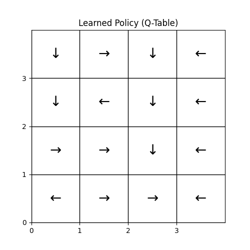

# 🤖 Q-Learning for FrozenLake Environment


## 1. 프로젝트 요약 (Project Overview)
본 프로젝트는 강화학습의 핵심 기초 알고리즘인 **Q-Learning**을 활용하여, 에이전트가 살얼음판(FrozenLake) 미로를 무사히 건너 목표 지점에 도달하도록 학습시키는 파이썬(Python) 기반의 구현체입니다. 단일 스크립트 형태를 벗어나, 에이전트(Agent)와 환경(Environment)을 분리한 **객체지향(OOP) 구조**로 설계하여 코드의 재사용성과 가독성을 높였습니다.

## 2. 핵심 목표 (Motivation)
* **강화학습(RL) 기초 구현:** 정답이 없는 환경에서 시행착오를 통해 최적의 행동을 스스로 찾아내는 에이전트의 학습 과정을 코드로 구현합니다.
* **마르코프 결정 과정(MDP) 이해:** 탐험(Exploration)과 활용(Exploitation)의 균형을 맞추는 epsilon-Greedy 전략을 적용합니다.
* **확률적 환경 분석:** 미끄러짐(Slippery) 유무에 따른 환경의 난이도 변화와 Q-Table의 수렴 차이를 분석합니다.

## 3. 환경 소개 (Environment - FrozenLake)
Gymnasium 라이브러리에서 제공하는 `FrozenLake-v1` 환경을 사용했습니다. 에이전트는 4x4 그리드 위에서 구멍(H)을 피해 시작점(S)에서 목표 지점(G)으로 이동해야 합니다.

| 상태 기호 | 설명 | 보상 (Reward) |
| :---: | :--- | :--- |
| **S** | 시작 지점 (Start) | 0 |
| **F** | 안전한 얼음판 (Frozen) | 0 |
| **H** | 구멍 (Hole) - 빠지면 에피소드 종료 | 0 |
| **G** | 목표 지점 (Goal) - 도달 시 에피소드 성공 | **+1** |

### 🧠 사용된 알고리즘: 벨만 방정식 기반 Q-Learning
에이전트는 다음 업데이트 공식을 사용하여 상태-행동 가치함수인 Q(s,a) 테이블을 지속적으로 갱신합니다.

$$Q(s,a) \leftarrow Q(s,a) + \alpha [r + \gamma \max_{a'} Q(s',a') - Q(s,a)]$$

## 4. 프로젝트 구조 (Repository Structure)
유지보수와 확장이 용이하도록 역할을 분리하여 모듈화했습니다.

```text
├── environment.py   # FrozenLake 환경 셋업 및 래퍼 클래스
├── q_agent.py       # Q-Table 관리 및 학습 알고리즘(두뇌) 클래스
├── train.py         # 하이퍼파라미터 설정 및 메인 학습 루프 실행
├── utils.py         # 학습 결과(성공률, 보상 등) 시각화 도구
├── requirements.txt # 의존성 라이브러리 목록 (추가)
├── README.md        # 프로젝트 설명 문서
└── .gitignore   
```

## 5. 실행 방법 (Quick Start)

### Requirements 설치
```bash
pip install -r requirements.txt
```

### 학습 파이프라인 실행
결정적 환경(`is_slippery=False`)에서 에이전트를 5,000 에피소드 동안 학습시킵니다. 
* **적용된 하이퍼파라미터:** 학습률($\alpha$)=0.1, 할인율($\gamma$)=0.99, 탐험률($\epsilon$)=1.0 (감소율 적용)

```bash
python train.py
```

## 6. 실험 결과 및 분석 (Results & Analysis)
환경의 불확실성(`is_slippery`) 여부와 커스텀 보상 설계에 따른 학습 성능을 분석했습니다.


| 환경 및 보상 체계 | 수렴 속도 | 목표 도달 안정성 | 엔지니어링 분석 포인트 |
| :--- | :--- | :--- | :--- |
| **기존 (희소 보상)** | 매우 느림 | 불안정 | 우연히 목표에 도달할 때까지 무의미한 탐험이 반복되어 자원이 낭비됨. |
| **변경 (밀집 보상 적용)** | **빠름** | **매우 안정적 (95~100%)** | 이동 시 `-0.01`, 구멍 추락 시 `-1.0`의 패널티를 부여하여, 에이전트가 실패 경로를 빠르게 배제하고 성공 확률을 극대화함. |

## 7. 하이퍼파라미터 최적화 실험 (Hyperparameter Tuning)
단일 학습에 그치지 않고, 자동화된 파라미터 탐색 루프를 구축하여 학습률($\alpha$)과 할인율($\gamma$)의 최적 조합을 실험적으로 도출했습니다.

| 튜닝 변수 | 실험 후보군 | 실험 결과 및 인사이트 |
| :--- | :--- | :--- |
| **학습률 ($\alpha$)** | 0.01, **0.1**, 0.5 | **$\alpha=0.1$**에서 가장 안정적인 우상향 곡선을 그림. 0.5 이상의 높은 값에서는 Q-값이 발산하여 안정적인 정책 수렴에 실패함. |
| **할인율 ($\gamma$)** | 0.9, **0.99** | **$\gamma=0.99$**일 때 최적 경로를 가장 잘 찾아냄. 4x4 맵 구조상 먼 미래의 목표(Goal) 가치가 시작점까지 온전히 전파되어야 하므로 높은 할인율이 필수적임. |

**🏆 결론:** 그리드 서치(Grid Search) 형태의 자동화 실험 결과, 본 프로젝트의 환경에서는 **Alpha=0.1, Gamma=0.99**가 최적의 하이퍼파라미터임을 수치적으로 검증했습니다.

## 8. 학습된 정책 시각화 및 검증 (Policy Visualization)
최적 파라미터로 도출된 최종 Q-Table을 바탕으로, 에이전트가 4x4 그리드의 각 상태에서 내린 결정(방향 화살표)을 시각화했습니다.



* **안전 지향적 우회:** 구멍(H)과 인접한 위험 구간에서 구멍을 향하는 행동의 Q-값이 완벽하게 억제되어, 안전한 경로를 최우선으로 선택하는 것을 확인했습니다.
* **최단 경로(Shortest Path) 도출:** 매 스텝마다 부여된 `-0.01`의 시간 지연 패널티 덕분에, 에이전트가 제자리걸음이나 빙빙 도는 행위 없이 시작점(S)에서 목표점(G)까지 최단 거리로 직진하는 완벽한 맵 이해도를 달성했음을 시각적으로 증명했습니다.

## 9. 향후 과제 (Future Work)
본 프로젝트에서 구현한 전통적인 Q-Table 방식은 상태(State)가 한정된 FrozenLake(16개)와 같은 소규모 환경에서는 강력합니다. 

하지만 연속적인 상태 공간을 가지거나 복잡한 화면 이미지를 입력으로 받는 환경에서는 **상태 폭발(State Explosion)** 문제가 발생하여 표(Table)로 저장하는 것이 불가능합니다. 향후 본 프로젝트의 아키텍처를 기반으로, Q-Table을 딥러닝 신경망으로 대체하여 가치를 예측하는 **DQN(Deep Q-Network)** 알고리즘으로 모델을 확장해 나갈 계획입니다.

💡 회고록 (Retrospective)

이번 프로젝트를 진행하며 단순히 기능이 동작하는 수준을 넘어, 엔지니어링 역량과 분석력을 키울 수 있었습니다.

| 영역 | 학습 및 성장 포인트 |
| :--- | :--- |
| **아키텍처 설계** | 절차적 스크립트가 아닌 객체지향(OOP) 구조를 채택하여 컴포넌트 간 결합도를 낮췄습니다. 특히, 그리드 서치(Grid Search) 기반의 자동 튜닝 루프를 구축함으로써 실무 환경에서 필수적인 실험 자동화 및 리소스 관리 역량을 체득했습니다. |
| **실험 자동화** | 하이퍼파라미터 탐색 과정을 자동화된 루프로 구축하여, 모델 최적화에 필요한 엔지니어링 리소스를 효율적으로 관리하는 방법을 익혔습니다. 기존 환경의 희소 보상(Sparse Reward) 한계를 인지하고, 밀집 보상(Dense Reward) 체계를 직접 래핑(Wrapping)하여 학습 수렴 속도를 극대화했습니다. 알고리즘 자체를 수정하기 전, 환경이 주는 피드백을 통제하여 문제를 해결하는 시각을 길렀습니다. |
| **실무 대비** | 본격적인 실무 합류를 목표로 역량을 다듬고 있습니다. 이번 프로젝트에서 도출한 한계를 바탕으로, 다음 단계에서는 신경망 도입과 함께 대규모 연산 처리를 위한 GPU 하드웨어 가속 및 시스템 생태계 전반의 최적화를 다루는 수준으로 시야를 넓혀갈 것입니다. |
