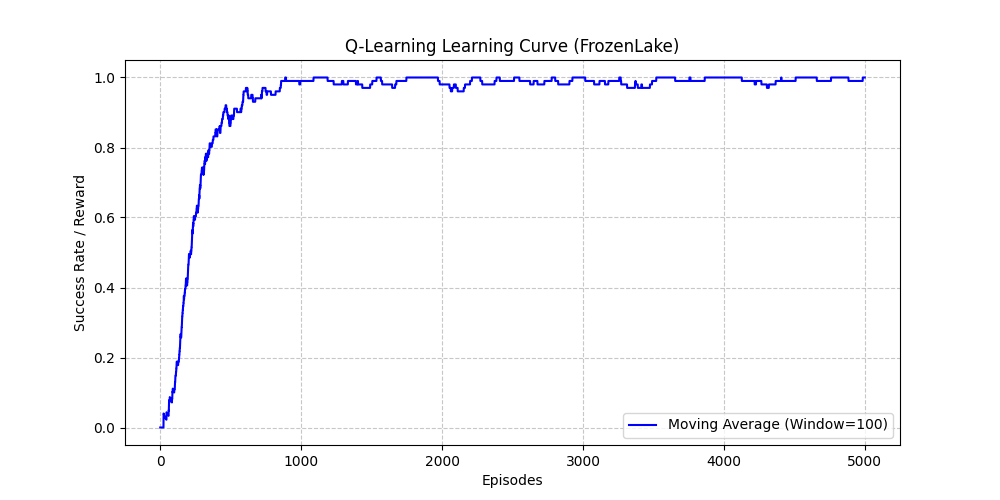
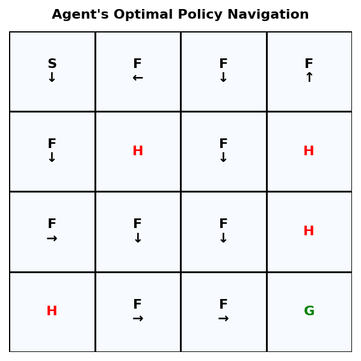

# 🤖 Q-Learning for FrozenLake Environment


---

## 📌 프로젝트 요약 (Project Overview)
본 프로젝트는 강화학습의 핵심 기초 알고리즘인 **Q-Learning**을 활용하여, 에이전트가 살얼음판(FrozenLake) 미로를 무사히 건너 목표 지점에 도달하도록 학습시키는 파이썬(Python) 기반의 구현체입니다. 단일 스크립트 형태를 벗어나, 에이전트(Agent)와 환경(Environment)을 분리한 **객체지향(OOP) 구조**로 설계하여 코드의 재사용성과 가독성을 높였습니다.

---

## 🎯 핵심 목표 (Motivation)
| 구분 | 세부 내용 |
| :--- | :--- |
| **강화학습(RL) 기초 구현** | 정답이 없는 환경에서 시행착오를 통해 최적의 행동을 스스로 찾아내는<br>에이전트의 학습 과정을 코드로 구현합니다. |
| **마르코프 결정과정(MDP) 이해** | 탐험(Exploration)과 활용(Exploitation)의 균형을 맞추는<br>epsilon-Greedy 전략을 적용합니다. |
| **확률적 환경 분석** | 미끄러짐(Slippery) 유무에 따른 환경의 난이도 변화와<br>Q-Table의 수렴 차이를 분석합니다. |

---

## 🚨 환경 소개 및 파이프라인 (Environment & Pipeline)
| 항목 | 세부 내용 |
| :--- | :--- |
| **상태 공간 (State)** | **S**: 시작 지점 (0) <br> **F**: 안전한 얼음판 (0) <br> **H**: 구멍 (0, 에피소드 종료) <br> **G**: 목표 지점 (+1, 에피소드 성공) |
| **사용된 알고리즘** | 벨만 방정식 기반 Q-Learning<br>$$Q(s,a) \leftarrow Q(s,a) + \alpha [r + \gamma \max_{a'} Q(s',a') - Q(s,a)]$$ |
| **학습 파이프라인** | 결정적 환경(`is_slippery=False`)에서 에이전트를 5,000 에피소드 동안 학습 |
| **적용된 파라미터** | 학습률(Alpha)=0.1, 할인율(Gamma)=0.99, 탐험률(Epsilon)=1.0 (감소율 적용) |

---

## 1. 프로젝트 구조 (Repository Structure)

```text
├─ results/  # 도출된 학습 곡선 및 정책 시각화 이미지
├─ src/  # 핵심 강화학습 파이프라인 모듈 (environment.py, q_agent.py, train.py, utils.py)
├─ .gitignore  
├─ LICENSE  
├─ README.md  # 프로젝트 설명 문서
└─ requirements.txt  # 의존성 패키지 목록
```

---

## 2. 실험 결과 및 분석 (Results & Analysis)


| 환경 및 보상 체계 | 수렴 속도 | 목표 도달 안정성 | 엔지니어링 분석 포인트 |
| :--- | :--- | :--- | :--- |
| **기존 (희소 보상)** | 매우 느림 | 불안정 | 우연히 목표에 도달할 때까지 무의미한 탐험이 반복되어 자원이 낭비됨. |
| **변경 (밀집 보상 적용)** | **빠름** | **매우 안정적 (95~100%)** | 이동 시 `-0.01`, 구멍 추락 시 `-1.0`의 패널티를 부여하여,<br>에이전트가 실패 경로를 빠르게 배제하고 성공 확률을 극대화함. |

## 3. 하이퍼파라미터 최적화 실험 (Hyperparameter Tuning)
| 튜닝 변수 | 실험 후보군 | 실험 결과 및 인사이트 |
| :--- | :--- | :--- |
| **학습률 (Alpha)** | 0.01, **0.1**, 0.5 | **Alpha=0.1**에서 가장 안정적인 우상향 곡선을 그림.<br>0.5 이상의 높은 값에서는 Q-값이 발산하여 안정적인 정책 수렴에 실패함. |
| **할인율 (Gamma)** | 0.9, **0.99** | **Gamma=0.99**일 때 최적 경로를 가장 잘 찾아냄.<br>4x4 맵 구조상 먼 미래의 목표(Goal) 가치가 시작점까지<br>온전히 전파되어야 하므로 높은 할인율이 필수적임. |
| **🏆 최종 결론** | **Alpha=0.1**<br>**Gamma=0.99** | 그리드 서치(Grid Search) 형태의 자동화 실험 결과,<br>본 프로젝트의 환경에서는 해당 조합이 최적의 하이퍼파라미터임을 검증했습니다. |

## 4. 학습된 정책 시각화 및 검증 (Policy Visualization)


| 정책 검증 포인트 | 세부 분석 내용 |
| :--- | :--- |
| **안전 지향적 우회** | 구멍(H)과 인접한 위험 구간에서 구멍을 향하는 행동의 Q-값이 완벽하게 억제되어,<br>안전한 경로를 최우선으로 선택하는 것을 확인했습니다. |
| **최단 경로 도출** | 매 스텝마다 부여된 `-0.01`의 시간 지연 패널티 덕분에,<br>에이전트가 제자리걸음이나 빙빙 도는 행위 없이 시작점(S)에서<br>목표점(G)까지 최단 거리로 직진하는 완벽한 맵 이해도를 시각적으로 증명했습니다. |

## 5. 향후 과제 (Future Work)
본 프로젝트에서 구현한 전통적인 Q-Table 방식은 상태(State)가 한정된 FrozenLake(16개)와 같은 소규모 환경에서는 강력합니다. 하지만 연속적인 상태 공간을 가지거나 복잡한 화면 이미지를 입력으로 받는 환경에서는 **상태 폭발(State Explosion)** 문제가 발생하여 표(Table)로 저장하는 것이 불가능합니다. 향후 본 프로젝트의 아키텍처를 기반으로, Q-Table을 딥러닝 신경망으로 대체하여 가치를 예측하는 **DQN(Deep Q-Network)** 알고리즘으로 모델을 확장해 나갈 계획입니다.

## 6. 💡 회고록 (Retrospective)
이번 프로젝트는 단순히 기능이 동작하는 수준을 넘어, 엔지니어링 역량과 데이터 분석력을 체화한 중요한 계기였습니다. 

가장 먼저 절차적 스크립트에 머물지 않고 객체지향(OOP) 구조를 채택하여 컴포넌트 간 결합도를 낮추는 아키텍처 설계를 고민했습니다. 기존 환경의 희소 보상(Sparse Reward) 한계를 인지하고 밀집 보상(Dense Reward) 체계를 직접 래핑(Wrapping)하여 학습 수렴 속도를 극대화하는 과정에서, 알고리즘 자체를 수정하기 이전에 환경이 주는 피드백을 먼저 통제하여 문제를 해결하는 시각을 길렀습니다. 특히 하이퍼파라미터 탐색(Grid Search) 과정을 자동화된 루프로 구축하여 모델 최적화에 투입되는 엔지니어링 리소스를 효율적으로 관리하는 실무적 접근법을 익혔습니다. 

이번 프로젝트에서 도출한 한계를 바탕으로, 다음 단계에서는 신경망 도입과 함께 대규모 연산 처리를 위한 GPU 하드웨어 가속 및 시스템 생태계 전반의 최적화까지 시야를 넓혀갈 것입니다. 본격적인 실무 합류를 목표로, 어떤 복잡한 환경적 난제라도 데이터와 아키텍처를 기반으로 뚫어내는 준비된 엔지니어로서의 역량을 계속해서 증명해 나가겠습니다.
